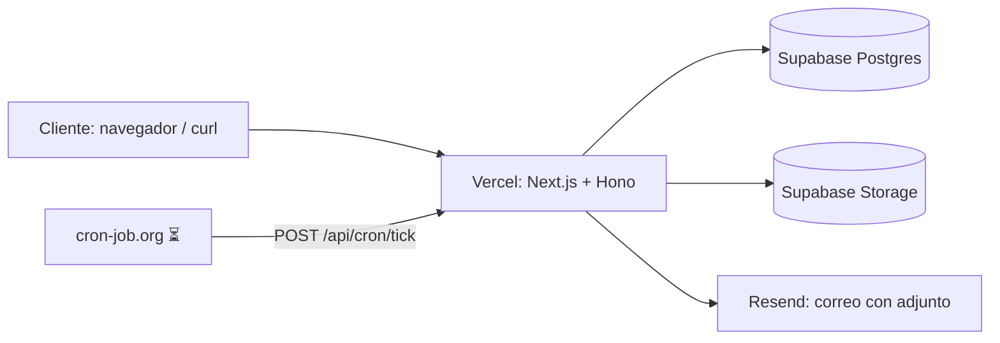
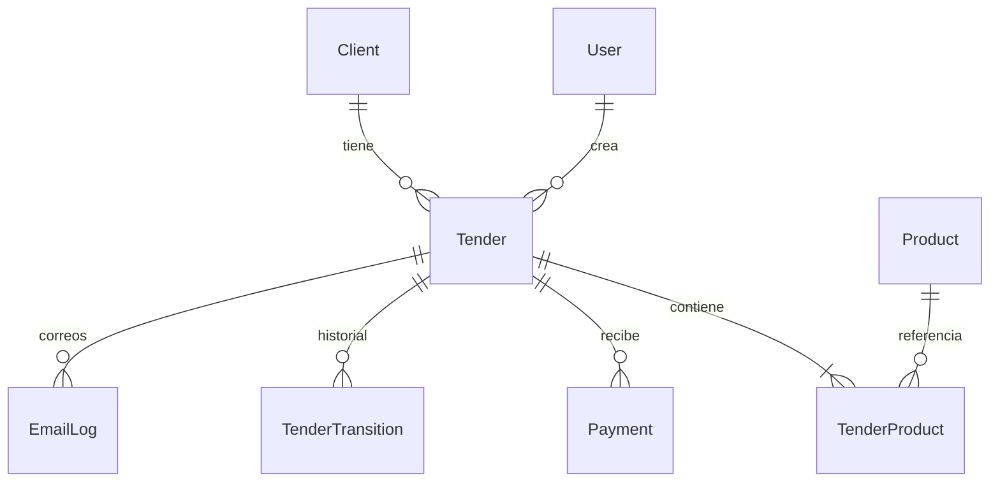
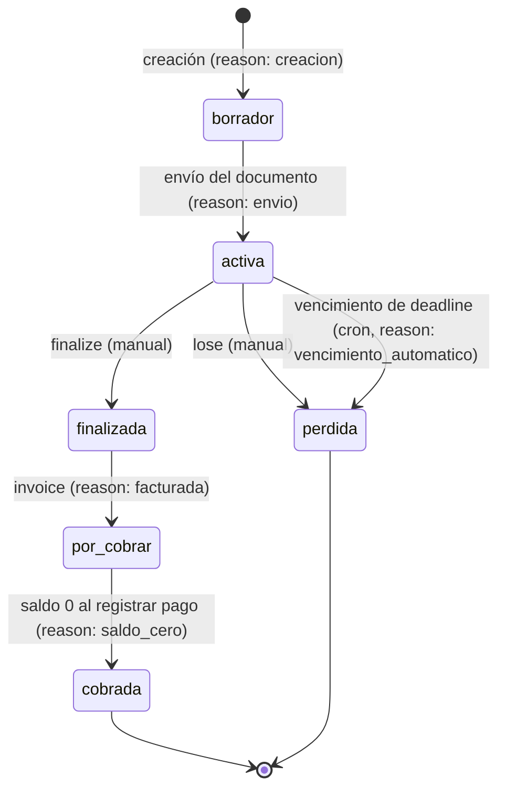
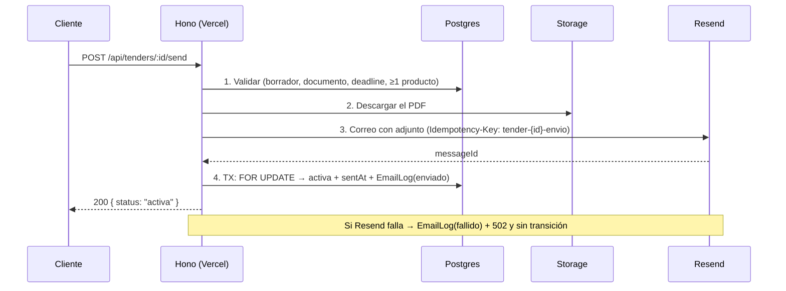

# Sistema de Gestión de Licitaciones

## 1. Encabezado y acceso rápido

Gestión de licitaciones de principio a fin: creación de propuestas con productos y presupuesto, documento PDF en Supabase Storage, envío real por correo con adjunto, máquina de estados con historial y trazabilidad completa de correos. Backend desplegado en Vercel y conectado a Supabase; frontend pendiente (fases 8-9).

**Demo:** https://sistema-de-gesti-n-de-licitaciones.vercel.app · **Health:** [/api/health](https://sistema-de-gesti-n-de-licitaciones.vercel.app/api/health) · **Docs API:** `/api/docs` ⏳ (fase 9)

**Credenciales demo (solo evaluación, cámbialas en cualquier entorno real):**

| Rol | Email | Password |
|---|---|---|
| admin | `admin@example.com` | `CambiaEstaClave123!` |
| user | `user@example.com` | `CambiaEstaClave123!` |

### Estado por fases

| Fase | Contenido | Estado |
|---|---|---|
| 1 | Repo, schema + migraciones, seed, `/api/health`, despliegue Vercel, spike Storage + Resend | ✅ |
| 2 | Auth JWT (cookie), roles, usuarios/clientes/productos con auditoría | ✅ |
| 3 | Máquina de estados, `transition()` con bloqueo de fila, historial + tests | ✅ |
| 4 | CRUD de licitaciones, productos con regla de presupuesto + tests | ✅ |
| 5 | Documento (signed URL) y envío real con adjunto + `EmailLog` + idempotencia | ✅ |
| 6 | Facturación y pagos transaccionales (auto-`cobrada`) | ✅ |
| 7 | Jobs de vencimiento y recordatorio, `/api/cron/tick` en producción | ✅ |
| 8 | Frontend: login, layout, formularios de clientes/productos/usuarios | ⏳ pendiente |
| 9 | Detalle de licitación, panel de próximas a vencer, `/api/docs` | ⏳ pendiente |
| 10 | Evidencias, E2E en producción, limpieza final | ⏳ pendiente |

---

## 2. Stack y por qué

| Pieza | Versión | Por qué |
|---|---|---|
| Next.js | 15.5 | Frontend (fases 8-9) y host de la API en un solo runtime; tipos compartidos cliente/servidor |
| Hono + `@hono/zod-openapi` | 4.13 / 1.6 | API ultraligera con middleware reutilizable y base para Swagger (`/api/docs`, pendiente) |
| Prisma | 6.19 | ORM tipado, migraciones versionadas y `Decimal` para dinero |
| Supabase (Postgres) | — | BD gestionada con pooler; migraciones vía `DIRECT_URL` |
| Supabase Storage | — | Subida de PDFs con signed URLs y URL pública verificable como evidencia |
| Resend | 6.32 | Correo real con adjunto, `Idempotency-Key` para reintentos sin duplicar |
| Vercel | — | Deploy continuo desde GitHub, variables de entorno, health check y Vercel Cron de respaldo (`vercel.json`) |
| cron-job.org | — | Tick cada 15 min en producción, fuera del límite de Vercel Hobby |
| Vitest | 3.2 | Tests unitarios e de integración contra BD real |
| Zod | 4.6 | Validación de entrada en routes y `.env` |

## 3. Arquitectura

### Estructura de carpetas

```
app/                        # Next.js (App Router) — frontend pendiente fases 8-9
src/
  server/
    api/                    # Hono: routes/, middleware/ (auth, errores), guard.ts
    services/               # Toda la lógica de negocio; únicos que tocan Prisma
    domain/                 # Puro, sin I/O: state-machine.ts, errors.ts
    lib/                    # db, env, email, storage, pagination, html
  app/page.tsx              # Página actual (placeholder)
prisma/                     # schema.prisma, migrations/, seed.ts
tests/                      # Vitest (9 archivos, 83 tests)
scripts/                    # db-report, send-evidence, cron-evidence, check-transitions
docs/                       # Evidencias (ver §12)
.env.example
```

**Regla de capas:** `routes` solo parsean/validan y llaman a `services`. `services` contienen la lógica y son los únicos que tocan Prisma. `domain` es puro (sin I/O).

### Diagrama de componentes



### Convenciones

- **Errores** — siempre `{ "error": { "code", "message", "details?" } }` con el HTTP correspondiente:

| Código | HTTP | Uso |
|---|---|---|
| `VALIDATION` | 400 | Datos inválidos (Zod, presupuesto, fechas, PDF) |
| `UNAUTHORIZED` | 401 | Sin sesión o credenciales inválidas |
| `FORBIDDEN` | 403 | Rol insuficiente (solo admin) |
| `NOT_FOUND` | 404 | Recurso inexistente |
| `INVALID_TRANSITION` / `NOT_EDITABLE` / `INVALID_STATE` / `CONFLICT` | 409 | Estado/versión en conflicto |
| `BUDGET_EXCEEDED` / `MISSING_PROPOSAL` / `DEADLINE_PASSED` / `PAYMENT_EXCEEDS_BALANCE` | 422 | Reglas de negocio |
| `EMAIL_FAILED` | 502 | Resend no pudo enviar |
| `INTERNAL` | 500 | Error no previsto |

- **Auditoría:** `createdById` / `updatedById` en todas las tablas operativas desde la fase 2.
- **Formato de respuestas:** objetos planos JSON (creación → `201`); listados → `{ data: [...], total, page, pageSize, totalPages }`; `DELETE` → `{ ok: true }`.
- **CSRF básico:** toda mutación exige `Content-Type: application/json` (si no → `400`).
- **Auth:** cookie `session` (httpOnly, sameSite=lax, 8 h) o `Authorization: Bearer <jwt>` para probar en Swagger. Públicas: `/api/health`, `/api/spike`, `/api/auth/login`.

## 4. Instalación y ejecución local

### Requisitos

- Node 20+ (probado con Node 24)
- Cuenta [Supabase](https://supabase.com) (proyecto con Postgres + Storage)
- Cuenta [Resend](https://resend.com) (API key)
- Nota: no hay `docker-compose.yml` en el repo; los tests y el desarrollo usan la BD de desarrollo de Supabase (§13)

### Pasos

```bash
cp .env.example .env        # y completar (tabla abajo)
npm install                 # ejecuta prisma generate (postinstall)
npx prisma migrate dev      # crea el schema
npx prisma db seed          # admin + usuario demo
npm run dev                 # http://localhost:3000
npm test                    # 83 tests
```

Comandos útiles: `npm run typecheck` · `npm run lint` · `npm run build`.

### Variables de entorno

| Variable | Descripción |
|---|---|
| `DATABASE_URL` | Postgres vía **pooler transaccional (6543)** para la app (`pgbouncer=true`) |
| `DIRECT_URL` | Mismas credenciales para Prisma CLI (migraciones) |
| `JWT_SECRET` | Secreto de 32+ caracteres para firmar el JWT (HS256) |
| `JWT_EXPIRES_IN` | Duración de la sesión (default `8h`) |
| `SEED_ADMIN_*` / `SEED_USER_*` | Credenciales del seed (admin y demo `user`) |
| `SUPABASE_URL` | URL del proyecto Supabase |
| `SUPABASE_SERVICE_ROLE_KEY` | Clave server-side **nunca** expuesta al cliente |
| `SUPABASE_BUCKET` | Bucket de Storage (`proposals`) |
| `RESEND_API_KEY` | API key de Resend |
| `EMAIL_FROM` | Remitente (`onboarding@resend.dev` sin dominio verificado) |
| `CRON_SECRET` / `REMINDER_HOURS` | ⏳ (fase 7) secreto del endpoint cron y horas de recordatorio |
| `APP_URL` | URL base (local o producción) |

### Supabase

1. Crear proyecto → copiar URL y `service_role` key.
2. **Storage → crear bucket `proposals` (público):** la URL del documento debe ser accesible como evidencia (ver §10).
3. Credenciales de conexión: usar el **pooler transaccional `:6543`** en `DATABASE_URL` y `DIRECT_URL` (algunos firewalls bloquean 5432).

### Resend

1. Crear API key → `RESEND_API_KEY`.
2. Sin dominio verificado solo se envía desde `onboarding@resend.dev` **al correo del titular de la cuenta** y llega a **Spam**. Para producción: verificar dominio y cambiar `EMAIL_FROM` (§13).

### Despliegue (Vercel)

1. Importar el repo → Vercel detecta Next.js (build: `npm run build`).
2. Configurar las mismas variables de entorno en el proyecto de Vercel.
3. Verificar `GET /api/health` → `{"status":"ok","db":"up"}`.

## 5. Modelo de datos



| Entidad | Papel | Campos clave |
|---|---|---|
| `User` | Usuarios del sistema | `role` (admin/user), `active`, `passwordHash` (bcrypt) |
| `Client` | Clientes de las licitaciones | `email` (índice, no unique), `taxId`, `contactName` |
| `Product` | Catálogo reutilizable | `sku` unique, `basePrice NUMERIC(12,2)` |
| `Tender` | Licitación (entidad central) | `status`, `maxBudget`, `deadline` (UTC), `proposalPath/Url/Name/Size`, `sentAt`, `reminderSentAt`, `invoicedAmount/At` |
| `TenderProduct` | Línea de producto en la licitación | `quantity`, **`unitPrice` (copia del `basePrice` al agregar)**, unique `(tenderId, productId)` |
| `Payment` | Pagos de la licitación | `amount > 0` (CHECK), `paidAt`, `note` |
| `TenderTransition` | Historial de estados | `fromStatus` (null en creación), `toStatus`, `userId` (null = sistema), `reason` |
| `EmailLog` | Trazabilidad de correos | `type` (envio/recordatorio), `status` (enviado/fallido), `providerId` de Resend, `error` |

Decisiones de modelado: `borrador` es estado explícito en BD (aunque el enunciado lo llame implícito); dinero siempre en `NUMERIC(12,2)` + `Decimal` de Prisma (nunca `float`); fechas en UTC (`timestamptz`).

## 6. Máquina de estados



| Desde | Hasta | Quién / qué la dispara |
|---|---|---|
| *(null)* | `borrador` | `POST /api/tenders` (creación, `reason: creacion`) |
| `borrador` | `activa` | `POST /api/tenders/:id/send` (`reason: envio`) |
| `activa` | `finalizada` | `POST /api/tenders/:id/finalize` (`reason: manual`) |
| `activa` | `perdida` | `POST /api/tenders/:id/lose` (`reason: manual`) o cron (`reason: vencimiento_automatico`, `userId: null`) |
| `finalizada` | `por_cobrar` | `POST /api/tenders/:id/invoice` (`reason: facturada`) |
| `por_cobrar` | `cobrada` | `POST /api/tenders/:id/payments` cuando el saldo llega a 0 (`reason: saldo_cero`) |

Cualquier otra combinación → `409 INVALID_TRANSITION`.

### `transition()` (`src/server/services/tender.service.ts`)

1. `SELECT status FROM tenders WHERE id = $1 FOR UPDATE` — bloquea la fila dentro de la transacción.
2. Revalida con `canTransition(from, to)` **sobre el estado leído bajo bloqueo** (no el que el cliente creyó ver).
3. Actualiza `status` + `updatedById` y crea el registro en `TenderTransition` con `fromStatus`, `toStatus`, `userId` y `reason` — en la misma transacción.

Todo lo que cambia de estado pasa por aquí: es la única puerta y el historial nunca se desincroniza del estado.

### Edición por estado

- **Productos** editables solo en `borrador` y `activa` (`PRODUCT_EDITABLE`) → si no, `409 NOT_EDITABLE`.
- **Documento** modificable solo en `borrador` → si no, `409 NOT_EDITABLE` (tras el envío es inmutable, ver §10).

## 7. Reglas de negocio implementadas

| Regla | Dónde se aplica | Error |
|---|---|---|
| Σ (cantidad × precio) ≤ `maxBudget`, con `Decimal` (límite exacto OK, +1 centavo no) | `addProduct` / upsert en `tender-products.service.ts` | `422 BUDGET_EXCEEDED` |
| Productos solo editables en `borrador`/`activa` | `tender-products.service.ts` | `409 NOT_EDITABLE` |
| Documento solo modificable en `borrador` | `proposal.service.ts` (`requireBorrador`) | `409 NOT_EDITABLE` |
| `deadline` futura y `maxBudget > 0` al crear | `createTender` | `400 VALIDATION` |
| Envío solo desde `borrador` | `sendTender` | `409 INVALID_STATE` |
| Envío requiere documento | `sendTender` | `422 MISSING_PROPOSAL` |
| Envío requiere `deadline` vigente | `sendTender` | `422 DEADLINE_PASSED` |
| Envío requiere ≥ 1 producto | `sendTender` | `400 VALIDATION` |
| Transiciones solo según la tabla de la §6 | `transition()` | `409 INVALID_TRANSITION` |
| PDF ≤ 10 MB y `application/pdf` (validado en la petición **y** con los metadatos reales de Storage al confirmar) | `proposal.service.ts` | `400 VALIDATION` |
| El `path` confirmado pertenece a la licitación (`tenders/{id}/...`) | `confirmUpload` | `400 VALIDATION` |
| Facturación solo desde `finalizada` | `invoiceTender` | `409 INVALID_STATE` |
| Monto de factura y de pago > 0 (por defecto, factura = total de productos) | `invoiceTender` / `registerPayment` | `400 VALIDATION` |
| Pagos solo en `por_cobrar` | `registerPayment` | `409 INVALID_STATE` |
| Un pago nunca supera el saldo (`invoicedAmount − Σ pagos`), con `Decimal` | `registerPayment` (bajo `FOR UPDATE`) | `422 PAYMENT_EXCEEDS_BALANCE` |
| Saldo 0 → transición automática a `cobrada` en la misma transacción | `registerPayment` | — |
| Activa con `deadline` pasado → `perdida` automática | `expireTenders` (cron) | — |
| Recordatorio único por licitación dentro de la ventana `REMINDER_HOURS` | `sendReminders` (reclamo atómico) | — |

## 8. Flujo de envío y jobs programados

### Envío (fase 5)

`POST /api/tenders/:id/send` ejecuta 4 pasos **en este orden**:



1. **Validar** (estado, documento, deadline, productos) — antes de tocar Storage o Resend; cualquier fallo devuelve su error y no hay efectos secundarios.
2. **Descargar el PDF** de Storage — si Storage está caído, falla aquí y tampoco se envía correo.
3. **Enviar el correo** con adjunto vía Resend, con `idempotencyKey: tender-{id}-envio`.
4. **Transicionar en transacción:** `transition()` re-verifica el estado bajo `FOR UPDATE` y guarda `sentAt` + `EmailLog(enviado, providerId)` junto con el cambio de estado.

**Si el correo falla (paso 3):** se crea `EmailLog(fallido)` con el mensaje, la API responde `502 EMAIL_FAILED` y la licitación **sigue en `borrador`** — es decir, nunca queda "activa sin notificar".

**Idempotencia y fallo parcial:** si el correo salió pero la transacción del paso 4 falla (BD caída), el reintento usa la misma `Idempotency-Key` y Resend no crea un segundo correo. Riesgo residual: en ese caso el `EmailLog(enviado)` se pierde hasta el reintento (§13).

**Doble envío concurrente:** dos peticiones simultáneas pasan la validación, pero en el paso 4 solo una obtiene el `FOR UPDATE`; la otra relee `activa` y recibe `409 INVALID_TRANSITION`. Cubierto por test (`send.test.ts`).

### Vencimiento y recordatorio (fase 7)

`GET /api/cron/tick` con header `Authorization: Bearer <CRON_SECRET>` (comparación en tiempo constante; sin el secret → `401`). Ejecuta en este orden y devuelve `{ expired, reminded, errors, time }`:

1. **Vencimiento (regla 2):** licitaciones `activa` con `deadline` pasado → `perdida` con `reason: vencimiento_automatico` y `userId: null` (sistema), en transacción con `transition()`. Idempotente: si otro proceso ya la cambió, la ignora.
2. **Recordatorio (regla 5):** `activa` con `deadline` dentro de las próximas `REMINDER_HOURS` (48) y `reminderSentAt` null → correo con el resumen y "vence en X horas" (sin adjunto). El **reclamo atómico** (`UPDATE ... WHERE reminderSentAt IS NULL`) garantiza un solo envío aunque corran ticks simultáneos; si el correo falla se revierte el reclamo y se reintenta en el siguiente tick (con `EmailLog(fallido)`).

**Orden importa:** se vence primero para no recordar una licitación ya vencida.

**Disparadores en producción:**
- `cron-job.org` → tick cada 15 min (configuración manual, ver §12).
- `vercel.json` → respaldo diario a las 08:00 UTC; Vercel envía `Authorization: Bearer $CRON_SECRET` automáticamente si la variable existe en el proyecto.

## 9. API

| Método | Ruta | Rol | Descripción | Errores |
|---|---|---|---|---|
| POST | `/api/auth/login` | público | Login → cookie `session` | 401 |
| POST | `/api/auth/logout` | auth | Borra la cookie | 401 |
| GET | `/api/auth/me` | auth | Usuario actual | 401 |
| GET | `/api/users` | admin | Lista usuarios (paginación) | 401/403 |
| POST | `/api/users` | admin | Crea usuario | 400/401/403/409 |
| GET | `/api/clients` | auth | Lista clientes (`?q=&page=`) | 401 |
| POST | `/api/clients` | auth | Crea cliente | 400/401 |
| GET | `/api/products` | auth | Lista productos (`?q=&page=`) | 401 |
| POST | `/api/products` | auth | Crea producto | 400/401/409 (SKU) |
| GET | `/api/tenders` | auth | Lista (`?status=&clientId=&q=&page=&pageSize=`) | 400/401 |
| GET | `/api/tenders/expiring?days=` | auth | Activas a vencer (default 3 días, máx 50) | 400/401 |
| POST | `/api/tenders` | auth | Crea en `borrador` + historial | 400/401/404 |
| GET | `/api/tenders/:id` | auth | Detalle (productos, pagos, saldo, historial, correos) | 401/404 |
| GET | `/api/tenders/:id/transitions` | auth | Historial completo | 401/404 |
| POST | `/api/tenders/:id/products` | auth | Agrega producto (upsert de cantidad) | 400/401/404/409/422 |
| DELETE | `/api/tenders/:id/products/:productId` | auth | Quita producto | 401/404/409 |
| POST | `/api/tenders/:id/proposal/upload-url` | auth | Signed URL para subir PDF | 400/401/404/409 |
| POST | `/api/tenders/:id/proposal/confirm` | auth | Confirma documento (valida Storage) | 400/401/404/409 |
| POST | `/api/tenders/:id/send` | auth | Envío real + `activa` | 401/404/409/422/502 |
| POST | `/api/tenders/:id/invoice` | auth | `finalizada → por_cobrar` con `invoicedAmount` (default: total de productos) | 400/401/404/409 |
| POST | `/api/tenders/:id/payments` | auth | Registra pago; saldo 0 → `cobrada` automática | 400/401/404/409/422 |
| POST | `/api/tenders/:id/finalize` | auth | `activa → finalizada` | 401/404/409 |
| POST | `/api/tenders/:id/lose` | auth | `activa → perdida` | 401/404/409 |
| GET | `/api/cron/tick` | secret | Jobs: vencimiento + recordatorio (ver §8) | 401 |
| GET | `/api/health` | público | `{ status, time, db }` | — |
| GET | `/api/spike` | público | Prueba temporal de integraciones (fase 1) | — |

### Ejemplo del flujo completo (curl)

```bash
BASE=https://sistema-de-gesti-n-de-licitaciones.vercel.app
# o BASE=http://localhost:3000

# 0) Login (guarda la cookie)
echo '{"email":"admin@example.com","password":"CambiaEstaClave123!"}' > login.json
curl -s -c cookies.txt -H "Content-Type: application/json" -d @login.json $BASE/api/auth/login

# 1) Cliente y producto
echo '{"name":"ACME","email":"compras@acme.test"}' > client.json
CLIENT_ID=$(curl -s -b cookies.txt -H "Content-Type: application/json" -d @client.json $BASE/api/clients | node -p "JSON.parse(require('fs').readFileSync(0)).id")

echo '{"name":"Servicio consultoría","sku":"CONS-01","basePrice":3000}' > product.json
PRODUCT_ID=$(curl -s -b cookies.txt -H "Content-Type: application/json" -d @product.json $BASE/api/products | node -p "JSON.parse(require('fs').readFileSync(0)).id")

# 2) Crear licitación (presupuesto 5000)
echo "{\"clientId\":\"$CLIENT_ID\",\"title\":\"Licitación demo\",\"maxBudget\":5000,\"deadline\":\"2027-01-01T00:00:00Z\"}" > tender.json
TENDER_ID=$(curl -s -b cookies.txt -H "Content-Type: application/json" -d @tender.json $BASE/api/tenders | node -p "JSON.parse(require('fs').readFileSync(0)).id")

# 3) Agregar producto: 2 × 3000 = 6000 > 5000 → 422 BUDGET_EXCEEDED
echo "{\"productId\":\"$PRODUCT_ID\",\"quantity\":2}" > add.json
curl -s -b cookies.txt -H "Content-Type: application/json" -d @add.json $BASE/api/tenders/$TENDER_ID/products
# {"error":{"code":"BUDGET_EXCEEDED","message":"...excede el presupuesto..."}}

# 4) Corregir: quitar y volver a agregar 1 unidad (3000 ≤ 5000 → 201)
curl -s -b cookies.txt -X DELETE $BASE/api/tenders/$TENDER_ID/products/$PRODUCT_ID
echo "{\"productId\":\"$PRODUCT_ID\",\"quantity\":1}" > add.json
curl -s -b cookies.txt -H "Content-Type: application/json" -d @add.json $BASE/api/tenders/$TENDER_ID/products

# 5) Subir el PDF (signed URL + PUT directo a Storage)
echo '{"fileName":"propuesta.pdf","size":1024,"contentType":"application/pdf"}' > up.json
UP=$(curl -s -b cookies.txt -H "Content-Type: application/json" -d @up.json $BASE/api/tenders/$TENDER_ID/proposal/upload-url)
PATH_FILE=$(echo $UP | node -p "JSON.parse(require('fs').readFileSync(0)).path")
TOKEN=$(echo $UP | node -p "JSON.parse(require('fs').readFileSync(0)).token")
SUPABASE_URL=https://xxxx.supabase.co   # tu proyecto
BUCKET=proposals
echo '%PDF-1.4 ...' > propuesta.pdf     # o tu PDF real
curl -s -X PUT -H "Content-Type: application/pdf" --data-binary @propuesta.pdf \
  "$SUPABASE_URL/storage/v1/object/$BUCKET/$PATH_FILE?token=$TOKEN"

# 6) Confirmar y enviar (correo real con adjunto → activa)
echo "{\"path\":\"$PATH_FILE\"}" > confirm.json
curl -s -b cookies.txt -H "Content-Type: application/json" -d @confirm.json $BASE/api/tenders/$TENDER_ID/proposal/confirm
curl -s -b cookies.txt -X POST -H "Content-Type: application/json" $BASE/api/tenders/$TENDER_ID/send
# {"status":"activa","sentAt":"..."}

# 7) Cierre del ciclo: finalizar → facturar → cobrar
curl -s -b cookies.txt -X POST -H "Content-Type: application/json" $BASE/api/tenders/$TENDER_ID/finalize
curl -s -b cookies.txt -X POST -H "Content-Type: application/json" -d '{}' $BASE/api/tenders/$TENDER_ID/invoice
# {"status":"por_cobrar","invoicedAmount":"300",...}
echo '{"amount":300}' > pay.json
curl -s -b cookies.txt -H "Content-Type: application/json" -d @pay.json $BASE/api/tenders/$TENDER_ID/payments
# {"payment":{...},"balance":"0"}  y la licitación queda en cobrada

# 8) Tick del cron (fuera de la API con sesión)
curl -s -H "Authorization: Bearer $CRON_SECRET" $BASE/api/cron/tick
# {"expired":0,"reminded":0,"errors":[],"time":"..."}
```

## 10. Decisiones de diseño

| Decisión | Motivo | Alternativa descartada |
|---|---|---|
| Documento **inmutable tras el envío** (solo editable en `borrador`) | Trazabilidad: el PDF guardado es exactamente lo que recibió el cliente; un cambio posterior rompería la evidencia | Editar también en `activa` (el enunciado lo permite, pero debilita la prueba de qué se envió) |
| **Signed URL** en vez de subir el archivo por la función de la API | El binario no pasa por Vercel (límite ~4.5 MB) y el cliente sube directo a Storage con token de un solo uso | `POST multipart` con límite 4 MB (variante del plan; válida pero centraliza tráfico inútil) |
| **Copiar `unitPrice`** al agregar el producto | Si `basePrice` cambia después, las licitaciones existentes no se alteran (histórico estable) | Recalcular siempre desde `products.basePrice` (reescribe la historia) |
| **Correo antes de transicionar** + `Idempotency-Key` | Nunca queda "activa sin notificar"; el reintento tras fallo parcial no duplica el correo | Transicionar primero y avisar después (estado mentiría si el correo falla) |
| **`finalize`/`lose` como wrappers** de `changeState()` → `transition()` | Una sola puerta para el cambio de estado y el historial; los endpoints son alias semánticos | Lógica de estado propia en cada endpoint (reglas duplicadas) |
| **Sanitizar el nombre de archivo** y validar que el `path` empieza con `tenders/{id}/` | Evita path traversal y que un cliente confirme archivos ajenos | Confiar en el `path` que envía el cliente |
| **BD antes que Storage** al reemplazar documento: se guarda la referencia nueva y recién ahí se borra la anterior | Una referencia rota es peor que un archivo huérfano en Storage | Borrar primero (ventana con `proposalUrl` colgando) |
| Bucket `proposals` **público** | La URL del documento debe ser accesible y verificable como evidencia de entrega | Bucket privado + `createSignedUrl` temporal (más seguro, pero la URL no sirve como evidencia persistente) |
| **Cron externo (cron-job.org)** en vez de solo Vercel Cron | El plan Hobby de Vercel solo admite ticks diarios; el recordatorio necesita granularidad de 15 min. `vercel.json` queda como respaldo diario | Depender solo de Vercel Cron (mínimo 1/día, no sirve para recordatorios) |

## 11. Pruebas

```bash
npm test        # vitest run — 9 archivos, 83 tests
```

Corren contra la **BD de desarrollo** con usuarios de test (`test-admin@example.com` / `test-user@example.com`); `fileParallelism: false` para evitar carreras sobre las mismas filas.

| Archivo | Qué cubre |
|---|---|
| `auth.test.ts` | Login/logout/`me`, cookie, 403 por rol, CSRF (mutación sin JSON → 400) |
| `state-machine.test.ts` | Tabla completa de transiciones: 36 combinaciones permitidas/prohibidas + `PRODUCT_EDITABLE` |
| `transition.test.ts` | `FOR UPDATE`, 404, 409 con detalle `{from,to}`, registro en historial |
| `budget.test.ts` | Límite exacto aceptado, +1 centavo → 422, upsert descuenta el subtotal anterior |
| `tenders.test.ts` | HTTP: crear/listar con filtros, `finalize`/`lose`, `expiring`, detalle con totales |
| `proposal.test.ts` | **Storage real**: validación PDF/10 MB, flujo upload→confirm, path ajeno → 400, revalidación de estado, borrado del archivo anterior |
| `send.test.ts` | **Resend mockeado**: missing proposal, deadline, sin productos, estado inválido, OK → `activa` + `EmailLog` + idempotency key, `EMAIL_FAILED` 502 sin transición, doble envío concurrente (1 gana, 1 → 409) |
| `payments.test.ts` | Facturación (default = total, monto custom, 409 doble), pagos (422 con `details.balance`, auto-`cobrada`) y **concurrencia**: dos pagos simultáneos no exceden el saldo; una sola transición a `cobrada` |
| `jobs.test.ts` | Vencimiento (reason, `userId: null`, idempotente), recordatorio (ventana, sin duplicar, fallo → reintento, **reclamo concurrente = 1 correo**) y tick HTTP (401 sin secret, resumen del tick) |

**No se automatiza:** el correo real y el tick de cron-job.org en producción (se verifican a mano con las evidencias de §12).

## 12. Evidencias

Índice en [`docs/`](docs/README.md).

| Evidencia | Estado |
|---|---|
| Correo de envío con el PDF adjunto (inbox/Spam, fase 5) | ✅ `docs/evidencia-correo.png` |
| Correo de recordatorio del cron (inbox/Spam, fase 7) | ⏳ captura pendiente → `docs/evidencia-cron-correo.png` |
| `EmailLog` del envío real (providerId `01a116ae-eb87-786f-bdb9-e442a34f0cba`, estado `enviado`) | ✅ verificado en producción |
| Documento accesible por URL pública (HTTP 200, `application/pdf`) | ✅ [`Propuesta_Evidencia_Fase_5.pdf`](https://tcrjekibvnzjnbxdebto.supabase.co/storage/v1/object/public/proposals/tenders/ec4dda0d-e4d6-4883-bfbb-39fc0c813a41/1791381921609-Propuesta_Evidencia_Fase_5.pdf) |
| Prueba E2E en producción (checklist del enunciado) | ⏳ fase 10 |

## 13. Limitaciones conocidas y pendientes

**Pendientes por fase (ver tabla de §1):**

- **Fases 8-9:** frontend completo, panel de próximas a vencer, `/api/docs` (Swagger).
- **Fase 10:** E2E en producción, limpieza y credenciales.

**Limitaciones asumidas hoy:**

- **cron-job.org requiere cuenta externa:** el tick está implementado y desplegado, pero la tarea recurrente cada 15 min se configura a mano en la cuenta (§8); de respaldo, Vercel Cron corre a diario a las 08:00 UTC.
- **Endpoints de modificación/borrado** de usuarios, clientes y productos: solo existen listado y creación (`GET`/`POST`).
- **Fallo parcial del envío** (correo OK + BD caída): mitigado con `Idempotency-Key`, pero no hay cola de reintentos; el `EmailLog` se completa en el siguiente intento.
- **Resend sin dominio verificado:** remitente `onboarding@resend.dev`, entrega solo al titular y a Spam. Pendiente verificar dominio (§4).
- **Sin rate limit** ni bloqueo por intentos fallidos de login.
- **`/api/docs`** aún no existe (la app usa `OpenAPIHono`, el endpoint queda para la fase 9).
- **Tests contra BD de desarrollo** en lugar de Postgres local con Docker (no disponible en la máquina).
- **`prisma migrate deploy`** puede colgarse tras aplicar el SQL en este entorno (workaround: verificar con `scripts/db-report.js`); causa no resuelta.

---

### Guías rápidas

- **Subir un documento:** `POST /:id/proposal/upload-url` → `PUT` a Storage con `token` → `POST /:id/proposal/confirm`.
- **Enviar:** `POST /:id/send` (solo desde `borrador` con documento y deadline vigente).
- **Historial:** `GET /:id/transitions` y `GET /:id` (incluye `transitions` y `emails`).
- **Evidencia reproducible:** `node --env-file=.env --import tsx scripts/send-evidence.ts`.
